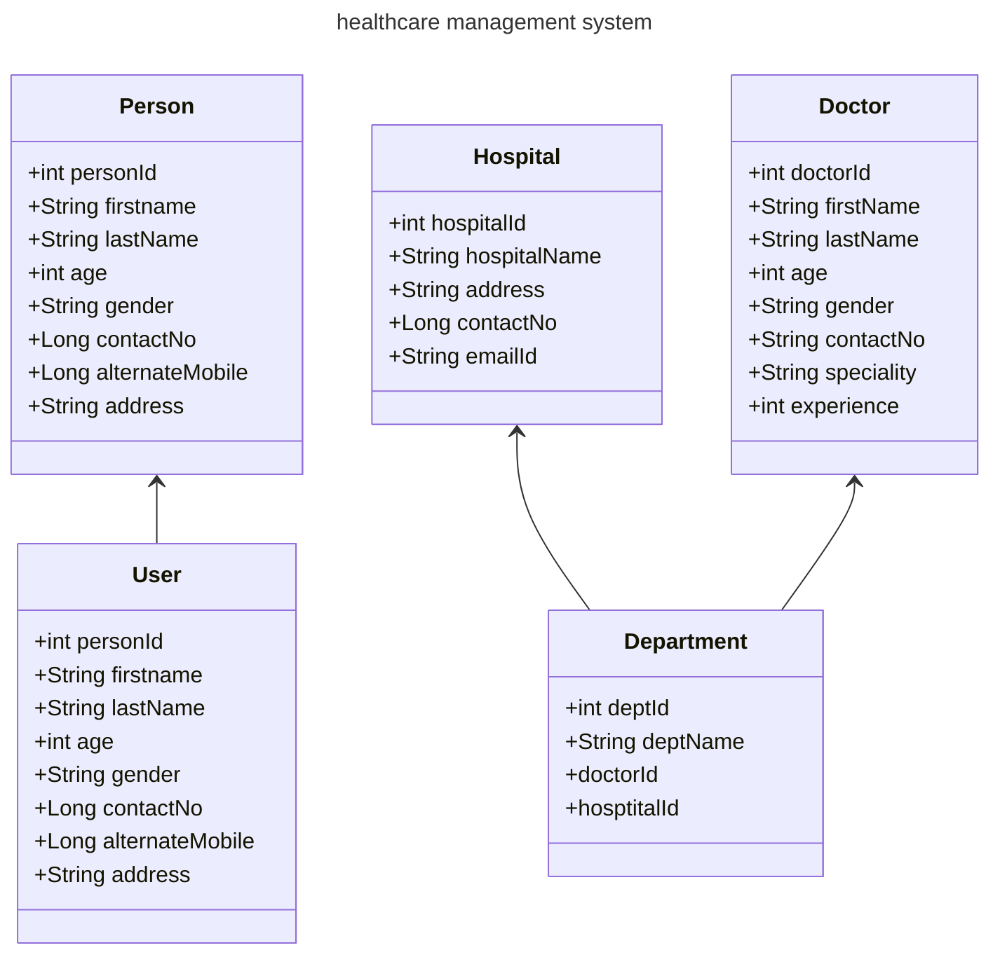

# inheritance-healthcare-management-system
implementation of inheritance
# Project Name : - healthcare-management-system.
Project Overview
The Core Java INHERITANCE healthcare Management Project is a basic Java application that demonstrates a Appointment booking management system. It utilizes object-oriented programming principles and simulates the interactions between persons, doctors, hospitals , and appointments.

# Features
Manage  for persons and doctors.
<ul>
  <li>Manage  for persons and doctors.</li>
  <li>Simulate appointment assignment.</li>
  <li>hospitals and appointment management using Java models.</li>
  <li>Simple and intuitive structure for learning and demonstration.</li>
</ul>

# Installation and Setup
Prerequisites
<ul>
  <li>Java Development Kit (JDK) 21.</li>
  <li>An Integrated Development Environment (IDE) such as IntelliJ IDEA or Eclipse.</li>
  <li>Git (optional, for version control).</li>
</ul>

# Steps
Clone the repository:
Navigate to the project directory:
<ul>
  <li>cd inheritance-healthcare-management-system</li>
  <li>Open the project in your preferred IDE.</li>
  <li>Compile and run the application:</li>
  <li>Locate Main.java.</li>
  <li>Run the file to start the application.</li>
</ul>

# POJO (Plain Old Java Objects)
<ul>
  <li>person - (id, fname, lname, age, gender, mobile, alternateMobile, address)</li>
  <li>doctor -(doctorid,fname,lname,age,gender,contactNo,speciality)</li>
  <li>hospital-(hopitalid,name,emailId,address,contactno</li>
</ul>

## class diagram

